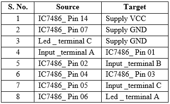

## Procedure
 

Click on **“Click Here”** in Simulation tab.

1.  Click on the **Component** button to place components on the table.

&emsp; &emsp; ")&emsp; &emsp; &emsp; ")  

**Fig. 1 Components** 

  
2.  Make connections as per the circuit diagram and pin diagram of IC or according to connection table.

 

**Fig. 2 Circuit diagram of BCD to Decimal decoder**

**Fig. 3 Pin diagram of IC 7442** 

**Table 1: Connection table**

  
 
  
3.  Click on **Check Connections** button. If connections are right, click on **'OK'**, then **Simulation** will become active.
4.  Provide the input by clicking toggle switches **A0**, **A1**, **A2** and **A3**.
5.  Fill the observed values in the **Truth Table**.
6.  Verify Truth Table by clicking on **Check** button, if outputs are correct then click on **'OK'**.
7.  Click on the **Reset** button to reset the page.

