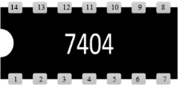

## Procedure 

#### Click on either the **"Even Parity Generator"** or **"Odd Parity Generator"** option from the **"Simulation"** tab. 

#### Familiarise with components:

  
&emsp; &emsp; &emsp; &emsp; &emsp; &emsp; &emsp; 

**Fig. 1: Components** 

#### Follow these steps to perform the experiment on simulator:

### **A. Even Parity Generator**

1\. Fill the truth table and click on '**CHECK**' button.  
2\. Click on the component button to place the component on the table.  
3\. Make connections as per the circuit diagram and pin diagram of the IC or according to connection table.  

**Fig. 2: Circuit diagram of even parity generator.**

**Fig. 3: Pin diagram of IC-7486.**

**Table 1: Connection table for even parity generator**

 

4\. Feed input **A** and **B** to one gate of IC and input **C** to another gate.  
5\. Click on '**Check Connections**' button. If connections are right, the '**Start Simulation**' button will become active. Click on it to start simulation.  
6\. Click on the toggle switches '**A**', '**B**' and '**C**' to perform simulation.
 

### **B. Odd Parity Generator**

1\. Fill the truth table and click on '**CHECK**' button.  
2\. Click on the component button to place the component on the table.  
3\. Make connections as per the circuit diagram and pin diagrams of the ICs or according to connection table.  

 

**Fig. 4: Circuit diagram of odd parity generator.**

**Fig. 5: Pin diagram of IC-7486.**

**Fig. 6: Pin diagram of IC-7404.**

**Table 2: Connection table for odd parity generator**

4\. Feed input **A** and **B** to one gate of IC and input **C** to another gate.  
5\. Click on '**Check Connections**' button. If connections are right, the '**Start Simulation**' button will become active. Click on it to start simulation.  
6\. Click on the toggle switches '**A**', '**B**' and '**C**' to perform simulation.

