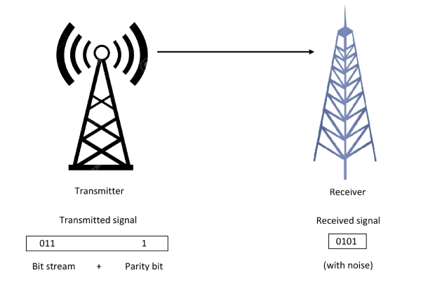
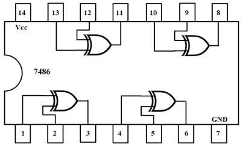
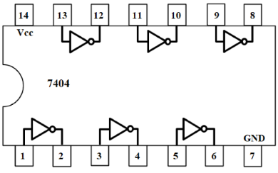

### Introduction

In digital electronic systems, during data transmission and processing, error may occur due to change of data bit (0 by 1 or vice versa). This change may be due to component malfunction or the electrical noise. One of the most widely used error detection techniques for transmission of data is Parity generating/checking. A parity bit is appended to the transmitted data by a parity generator and this bit is used to detect errors during the transmission of binary data.  
A parity bit is an extra bit included with a binary message to make the number of 1’s either odd or even. We have an even parity, when the added bit is such that the total number of 1s in the data bit string becomes even, and an odd parity, when the added bit makes the total number of 1s in the data bit string odd. This added bit could be a ‘0’ or a ‘1’.  

 

As an example, if we have to add an even parity bit to 01000001 (the eight-bit ASCII code for ‘A’), it will be a ‘0’ and the number will become 001000001. If we have to add an odd parity bit to the same number, it will be a ‘l’ and the number will become 101000001. The odd parity bit is a complement of the even parity bit.  
The message, including the parity bit, is transmitted and then checked at the receiving end for errors. An error is detected if the checked parity does not correspond to the one transmitted. The circuit that checks the parity in the receiver is called a paritychecker. A combined circuit or device consisting of parity generator and parity checker is commonly used in digital systems to detect the single bit errors in the transmitted data.  

### **Parity Generator**

Parity generator is a combinational circuit that accepts an (n-1)-bit stream data and generates the additional bit (termed as a parity bit) that is to be transmitted with the bit stream.The basic principle involved in the implementation of parity circuits is that sum of odd number of 1s is always 1 and sum of even number of 1s is always zero. Hence, XOR function, that produces 0 ( or 1) output when there are even ( or odd) number of 1s in the inputs, plays a pivotalrole in implementing such circuits. For example, an (n−1)-bit parity generator can be realized by implementing an (n−1)-bit XOR function. Both even and odd parity generators are discussed below.

### **1\. Even Parity Generator**

Let us assume that a 3-bit message is to be transmitted with an even parity bit. The three bits- A, B and C constitute the message and are the inputs to the circuit. The parity bit P is the output. For even parity, the bit P must be generated so as to make the total number of 1’s (including P) even. The circuit diagram of even parity generator shown in fig.1 along with the Boolean expression for even parity generator. In Table-1, the parity bit is 1 when the total number of 1’s is even as a whole (including parity bit).

**Fig. 1: Circuit diagram of even parity generator.**

**Table 1: Truth table of even parity generator**

<table style="text-align:center;margin-right:8%;color:black;">
       <tr style="border:1px solid black;font-size:130%;border-collapse:collapse;">
      <th colspan="3"; style="border:1px solid black;border-collapse:collapse;width:110px;text-align:center;">3-bit message</th>
      <th style="border:1px solid black;border-collapse:collapse;width:110px;text-align:center;" >Parity bit</th>
      </tr>
      <tr>
      <th style="border:1px solid black;font-size:110%;border-collapse:collapse;">A</th>
      <th style="border:1px solid black;font-size:110%;border-collapse:collapse;">B</th>
      <th style="border:1px solid black;font-size:110%;border-collapse:collapse;">C</th>
      <th style="border:1px solid black;font-size:110%;border-collapse:collapse;text-align:center">P</th>
      </tr>
      <tr>
      <td style="border:1px solid black;font-size:110%;border-collapse:collapse;">0</td>
      <td style="border:1px solid black;font-size:110%;border-collapse:collapse;">0</td>
      <td style="border:1px solid black;font-size:110%;border-collapse:collapse;">0</td>
      <td style="border:1px solid black;font-size:110%;border-collapse:collapse;">0</td>
      </tr> 
      <tr>
      <td style="border:1px solid black;font-size:110%;border-collapse:collapse;">0</td>
      <td style="border:1px solid black;font-size:110%;border-collapse:collapse;">0</td>
      <td style="border:1px solid black;font-size:110%;border-collapse:collapse;">1</td>
      <td style="border:1px solid black;font-size:110%;border-collapse:collapse;">1</td>
      </tr>
      <tr>
      <td style="border:1px solid black;font-size:110%;border-collapse:collapse;">0</td>
      <td style="border:1px solid black;font-size:110%;border-collapse:collapse;">1</td>
      <td style="border:1px solid black;font-size:110%;border-collapse:collapse;">0</td>
      <td style="border:1px solid black;font-size:110%;border-collapse:collapse;">1</td>
      </tr> 
      <tr>
      <td style="border:1px solid black;font-size:110%;border-collapse:collapse;">0</td>
      <td style="border:1px solid black;font-size:110%;border-collapse:collapse;">1</td>
      <td style="border:1px solid black;font-size:110%;border-collapse:collapse;">1</td>
      <td style="border:1px solid black;font-size:110%;border-collapse:collapse;">0</td>
      </tr> 
      <tr>
      <td style="border:1px solid black;font-size:110%;border-collapse:collapse;">1</td>
      <td style="border:1px solid black;font-size:110%;border-collapse:collapse;">0</td>
      <td style="border:1px solid black;font-size:110%;border-collapse:collapse;">0</td>
      <td style="border:1px solid black;font-size:110%;border-collapse:collapse;">1</td>
      </tr>
      <tr>
      <td style="border:1px solid black;font-size:110%;border-collapse:collapse;">1</td>
      <td style="border:1px solid black;font-size:110%;border-collapse:collapse;">0</td>
      <td style="border:1px solid black;font-size:110%;border-collapse:collapse;">1</td>
      <td style="border:1px solid black;font-size:110%;border-collapse:collapse;">0</td>
      </tr>
      <tr>
      <td style="border:1px solid black;font-size:110%;border-collapse:collapse;">1</td>
      <td style="border:1px solid black;font-size:110%;border-collapse:collapse;">1</td>
      <td style="border:1px solid black;font-size:110%;border-collapse:collapse;">0</td>
      <td style="border:1px solid black;font-size:110%;border-collapse:collapse;">0</td>
      </tr>
      <tr>
      <td style="border:1px solid black;font-size:110%;border-collapse:collapse;">1</td>
      <td style="border:1px solid black;font-size:110%;border-collapse:collapse;">1</td>
      <td style="border:1px solid black;font-size:110%;border-collapse:collapse;">1</td>
      <td style="border:1px solid black;font-size:110%;border-collapse:collapse;">1</td>
      </tr>
      </table>
      

  

**Boolean expression of even parity generator**

P= A'B'C +A'BC' + AB'C' + ABC  
P= A'(B'C + BC') + A(B'C' + BC)  
P= A’(B ⊕ C) + A(B ⊕ C)’  
**P= A ⊕ B ⊕ C**  

### **2\. Odd Parity Generator**

The three inputs- A, B and C produces P - the output parity bit, so as to make the total number of 1’s (including P) odd. The circuit diagram of odd parity generator shown in fig.2 along with the Boolean expression for odd parity generator.In Table-2, the parity bit is 1 when the total number of 1’s is odd as a whole (including parity bit).

**Fig. 2: Circuit diagram of odd parity generator.**

**Table 2: Truth table of odd parity generator**

<table style="text-align:center;margin-right:8%;color:black;">
      <tr style="border:1px solid black;font-size:130%;border-collapse:collapse;">
      <th colspan="3"; style="border:1px solid black;border-collapse:collapse;width:110px;text-align:center;">3-bit message</th>
      <th style="border:1px solid black;border-collapse:collapse;width:110px;text-align:center;" >Parity bit</th>
      </tr>
      <tr>
      <th style="border:1px solid black;font-size:110%;border-collapse:collapse;">A</th>
      <th style="border:1px solid black;font-size:110%;;border-collapse:collapse;">B</th>
      <th style="border:1px solid black;font-size:110%;;border-collapse:collapse;">C</th>
      <th style="border:1px solid black;font-size:110%;;border-collapse:collapse;text-align:center">P</th>
      </tr> 
      <tr>
      <td style="border:1px solid black;font-size:110%;;border-collapse:collapse;">0</td>
      <td style="border:1px solid black;font-size:110%;;border-collapse:collapse;">0</td>
      <td style="border:1px solid black;font-size:110%;;border-collapse:collapse;">0</td>
      <td style="border:1px solid black;font-size:110%;;border-collapse:collapse;">1</td>
      </tr>
      <tr>
      <td style="border:1px solid black;font-size:110%;;border-collapse:collapse;">0</td>
      <td style="border:1px solid black;font-size:110%;;border-collapse:collapse;">0</td>
      <td style="border:1px solid black;font-size:110%;;border-collapse:collapse;">1</td>
      <td style="border:1px solid black;font-size:110%;;border-collapse:collapse;">0</td>
      </tr>
      <tr>
      <td style="border:1px solid black;font-size:110%;;border-collapse:collapse;">0</td>
      <td style="border:1px solid black;font-size:110%;;border-collapse:collapse;">1</td>
      <td style="border:1px solid black;font-size:110%;;border-collapse:collapse;">0</td>
      <td style="border:1px solid black;font-size:110%;;border-collapse:collapse;">0</td>
      </tr>
      <tr>
      <td style="border:1px solid black;font-size:110%;;border-collapse:collapse;">0</td>
      <td style="border:1px solid black;font-size:110%;;border-collapse:collapse;">1</td>
      <td style="border:1px solid black;font-size:110%;;border-collapse:collapse;">1</td>
      <td style="border:1px solid black;font-size:110%;;border-collapse:collapse;">1</td>
      </tr>   
      <tr>
      <td style="border:1px solid black;font-size:110%;;border-collapse:collapse;">1</td>
      <td style="border:1px solid black;font-size:110%;;border-collapse:collapse;">0</td>
      <td style="border:1px solid black;font-size:110%;;border-collapse:collapse;">0</td>
      <td style="border:1px solid black;font-size:110%;;border-collapse:collapse;">0</td>
      </tr>   
      <tr>
      <td style="border:1px solid black;font-size:110%;;border-collapse:collapse;">1</td>
      <td style="border:1px solid black;font-size:110%;;border-collapse:collapse;">0</td>
      <td style="border:1px solid black;font-size:110%;;border-collapse:collapse;">1</td>
      <td style="border:1px solid black;font-size:110%;;border-collapse:collapse;">1</td>
      </tr>     
      <tr>
      <td style="border:1px solid black;font-size:110%;;border-collapse:collapse;">1</td>
      <td style="border:1px solid black;font-size:110%;;border-collapse:collapse;">1</td>
      <td style="border:1px solid black;font-size:110%;;border-collapse:collapse;">0</td>
      <td style="border:1px solid black;font-size:110%;;border-collapse:collapse;">1</td>
      </tr>     
      <tr>
      <td style="border:1px solid black;font-size:110%;;border-collapse:collapse;">1</td>
      <td style="border:1px solid black;font-size:110%;;border-collapse:collapse;">1</td>
      <td style="border:1px solid black;font-size:110%;;border-collapse:collapse;">1</td>
      <td style="border:1px solid black;font-size:110%;;border-collapse:collapse;">0</td>
      </tr>      
      </table>
      

  

**Boolean expression of even parity generator**

P= A'B'C' +A'BC + AB'C + ABC'  
P= A'(B'C' + BC) + A(B'C + BC')  
P= A’(B ⊕ C)' + A(B ⊕ C)  
**P= (A ⊕ B ⊕ C)'**  

### **APPLICATIONS AND LIMITATIONS OF PARITY GENERATOR**

*   The parity bit is used in applications where a simple error detector is needed and the transmission can be repeated if an error occurs.
*   This method needs only a single bit to detect errors, which can increase the number of transmissions within a period.
*   The most important application is in serial data transmission. It is based on a common format of 7 or 8 data bits, an even parity bit, and one or two stop bits.
*   Other applications of parity bits are SCSI buses, PCI buses, and many microprocessor instructions caches. Because the L-cache data is just a copy of main memory, it can be disregarded and re-fetched if it is found to be corrupted.

This simple parity code suffers from two limitations:  

*   Firstly, the addition of a single parity bit cannot be used to detect two-bit errors.
*   Secondly, the single-bit parity code cannot be used to localize or identify the error bit even if one bit is in error. If a binary stream with errors is received, the receiver must discard it.

### **Pin Diagram of IC-7486 and IC-7404:**

&emsp;  

