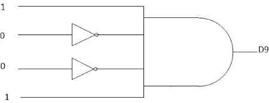
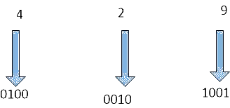
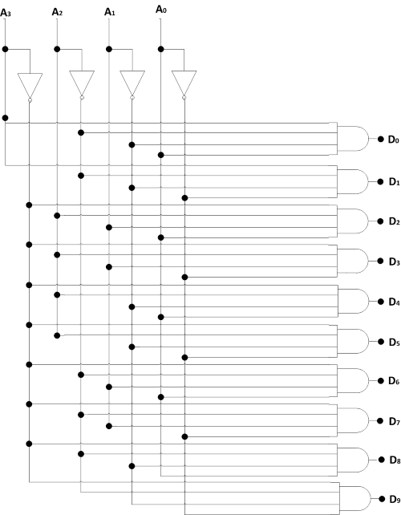
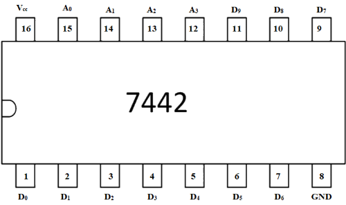

### Introduction

### **Decoder**

A decoder is a logic circuit that converts an n-bit binary input code (data) into 2n output lines, such that each output line will be activated for only one of the possible combinations of the inputs. A decoder is similar to demultiplexer but without any data input. In a decoder the number of outputs is greater than the number of inputs. If the number of inputs and outputs are equal in a digital system then it can be called converter, e.g. BCD to Excess-3 code, Binary to Gray and Gray to Binary converters. Most digital systems require decoding of data. It is necessary in applications such as data multiplexing, digital display, digital to analog convertor and memory addressing.

### **Basic Binary Decoder**

An AND gate can be used as the basic decoding element because its output is HIGH only when all the inputs are HIGH. For example, if the input binary number is 1001 then to make all the inputs of AND gate HIGH, the two middle bits (0s) must be inverted by using two NOT gates. (as shown in fig. 1)

  
  

**Fig 1: Basic binary decoder** 
  

If a NAND gate is used in place of the AND gate then a LOW output is generated to indicate the presence of the proper binary code.

### **Change of decimal into BCD form**

BCD is an abbreviation for binary coded decimal. The BCD codes express each digit in a decimal number by its nibble equivalent. For instance, Decimal number 429 is changed to its BCD form as follows–

 

To anyone using the BCD code, 0100 0010 1001 is equivalent to 429. We have changed each decimal digit to its binary equivalent.  
Some early computers processed BCD numbers. This means that the decimal numbers were changed into BCD numbers, which the computer then added, subtracted etc. The final answer was converted from BCD back to decimal numbers. Here is an example of how to convert from BCD form back to the decimal numbers.  

  

As we can see 578 is the decimal number of 0101 0111 1000 .  
One final point should be considered, notice that BCD digits are from 0000 to 1001. All combinations above this (1010 to 1111) cannot exist in the BCD code because the highest decimal digit being coded is 9.

### **BCD TO Decimal Decoder**

A decoder that takes a 4-bit BCD as the input code and produces 10 outputs corresponding to the decimal digits is called a BCD to decimal decoder (as shown in fig. 2). The logic diagram of a BCD to decimal decoder using AND gates is shown in fig. 1. Here each output goes high when its corresponding BCD code is applied at inputs.

  

**Fig 2: 1 to 10 decoder** 

For example, the output D5 will go HIGH only when 0101(BCD for 5) occurs at the 10 input lines is HIGH. Here subscript of the HIGH output always equals the decimal equivalent of the input BCD digits.  
For instance, when A3A2A1A0 is 0011, only D3 AND gate has all HIGH inputs, therefore, only the D3 output is HIGH. If A3A2A1A0 changes to 1000, only the D8 AND gate has all HIGH inputs. As a result only the D8 output goes HIGH.  
If we check the other A3A2A1A0 possibilities (0000 to 1001), we will find that the subscript of the high output always equals the decimal equivalent of the input BCD digit. For this reason, the circuit is also called a BCD to decimal decoder.  
Typically, we would not build a decoder with separate inverter and AND gates, as shown in Fig.1 Instead, we would use a TTL IC like 7442 (Fig.3).

  

**Fig 3: Circuit diagram of BCD-to-Decimal Decoder** 

A list of BCD to decimal decoder ICs is given in table 1 below.

 

**Table 1: BCD to decimal decoder/driver ICs** 

|IC|Output circuits|Applications|
| :--: | :--: | :--: |
|7441|Open collector|Nixie tube driver|
|7442|Totem pole|LED driver|
|7445|Open collector|Indicator/relay driver|
|74141|\-do-|Nixie tube driver|
|74145|\-do-|Indicator/relay driver|
|74445|\-do-|Indicator/relay driver|

 

TTL IC 7445 is BCD to decimal decoder/driver. The term driver is added to its description because this IC has open connector output that can operate at high current and voltage limits than a normal TTL output. The output of 7445 can sink 80 mA in the LOW state and can be raised up to 30 V in the HIGH State. This makes it possible for them to drive loads such as indicator LEDs or lamps, relay or DC motors.

### **IC 7442**

The pin out diagram of IC 7442 shown in Fig.4. Pin 16 connects to the supply voltage Vcc and pin 8 is grounded. Pin 12 to 15 are for BCD inputs (A3A2A1A0), while pin 1 to 7 and 9 to 11 are for the outputs. This IC is functionally equivalent to the one in fig.2, except that the active output line is in the low state. All other outputs are in high state as shown in truth table (Table 2). For all valid BCD codes, the corresponding output will be in the low state while all other output lines are in high state. An invalid BCD input (1010 to 1111) forces all output lines into high state. The output of any gate will go low if all its outputs are high. This type of decoder has active high inputs and active low outputs.

**Fig 4: Pin diagram of IC 7442** 

**Table 2: Truth Table of BCD to Decimal Decoder**  

<table border="1" width="800" ; style="text-align:center">
                        <tr>
                            <th colspan="1">S. No.</th>
                            <th colspan="4">BCD INPUT</th>
                            <th colspan="10">OUTPUT</th>
                        </tr>
                        <tr>
                            <th></th>
                            <th>A0</th>
                            <th>A1</th>
                            <th>A2</th>
                            <th>A3</th>
                            <th>D0</th>
                            <th>D1</th>
                            <th>D2</th>
                            <th>D3</th>
                            <th>D4</th>
                            <th>D5</th>
                            <th>D6</th>
                            <th>D7</th>
                            <th>D8</th>
                            <th>D9</th>
                        </tr>
                        <tr>
                            <td>0</td>
                            <td>L</td>
                            <td>L</td>
                            <td>L</td>
                            <td>L</td>
                            <td>H</td>
                            <td>L</td>
                            <td>L</td>
                            <td>L</td>
                            <td>L</td>
                            <td>L</td>
                            <td>L</td>
                            <td>L</td>
                            <td>L</td>
                            <td>L</td>
                        </tr>
                        <tr>
                            <td>1</td>
                            <td>L</td>
                            <td>L</td>
                            <td>L</td>
                            <td>H</td>
                            <td>L</td>
                            <td>H</td>
                            <td>L</td>
                            <td>L</td>
                            <td>L</td>
                            <td>L</td>
                            <td>L</td>
                            <td>L</td>
                            <td>L</td>
                            <td>L</td>
                        </tr>
                        <tr>
                            <td>2</td>
                            <td>L</td>
                            <td>L</td>
                            <td>H</td>
                            <td>L</td>
                            <td>L</td>
                            <td>L</td>
                            <td>H</td>
                            <td>L</td>
                            <td>L</td>
                            <td>L</td>
                            <td>L</td>
                            <td>L</td>
                            <td>L</td>
                            <td>L</td>
                        </tr>
                        <tr>
                            <td>3</td>
                            <td>L</td>
                            <td>L</td>
                            <td>H</td>
                            <td>H</td>
                            <td>L</td>
                            <td>L</td>
                            <td>L</td>
                            <td>H</td>
                            <td>L</td>
                            <td>L</td>
                            <td>L</td>
                            <td>L</td>
                            <td>L</td>
                            <td>L</td>
                        </tr>
                        <tr>
                            <td>4</td>
                            <td>L</td>
                            <td>H</td>
                            <td>L</td>
                            <td>L</td>
                            <td>L</td>
                            <td>L</td>
                            <td>L</td>
                            <td>L</td>
                            <td>H</td>
                            <td>L</td>
                            <td>L</td>
                            <td>L</td>
                            <td>L</td>
                            <td>L</td>
                        </tr>
                        <tr>
                            <td>5</td>
                            <td>L</td>
                            <td>H</td>
                            <td>L</td>
                            <td>H</td>
                            <td>L</td>
                            <td>L</td>
                            <td>L</td>
                            <td>L</td>
                            <td>L</td>
                            <td>H</td>
                            <td>L</td>
                            <td>L</td>
                            <td>L</td>
                            <td>L</td>
                        </tr>
                        <tr>
                            <td>6</td>
                            <td>L</td>
                            <td>H</td>
                            <td>H</td>
                            <td>L</td>
                            <td>L</td>
                            <td>L</td>
                            <td>L</td>
                            <td>L</td>
                            <td>L</td>
                            <td>L</td>
                            <td>H</td>
                            <td>L</td>
                            <td>L</td>
                            <td>L</td>
                        </tr>
                        <tr>
                            <td>7</td>
                            <td>L</td>
                            <td>H</td>
                            <td>H</td>
                            <td>H</td>
                            <td>L</td>
                            <td>L</td>
                            <td>L</td>
                            <td>L</td>
                            <td>L</td>
                            <td>L</td>
                            <td>L</td>
                            <td>H</td>
                            <td>L</td>
                            <td>L</td>
                        </tr>
                        <tr>
                            <td>8</td>
                            <td>H</td>
                            <td>L</td>
                            <td>L</td>
                            <td>L</td>
                            <td>L</td>
                            <td>L</td>
                            <td>L</td>
                            <td>L</td>
                            <td>L</td>
                            <td>L</td>
                            <td>L</td>
                            <td>L</td>
                            <td>H</td>
                            <td>L</td>
                        </tr>
                        <tr>
                            <td>9</td>
                            <td>H</td>
                            <td>L</td>
                            <td>L</td>
                            <td>H</td>
                            <td>L</td>
                            <td>L</td>
                            <td>L</td>
                            <td>L</td>
                            <td>L</td>
                            <td>L</td>
                            <td>L</td>
                            <td>L</td>
                            <td>L</td>
                            <td>H</td>
                        </tr>
                        <tr>
                            <td>I</td>
                            <td>H</td>
                            <td>L</td>
                            <td>H</td>
                            <td>L</td>
                            <td>H</td>
                            <td>H</td>
                            <td>H</td>
                            <td>H</td>
                            <td>H</td>
                            <td>H</td>
                            <td>H</td>
                            <td>H</td>
                            <td>H</td>
                            <td>H</td>
                        </tr>
                        <tr>
                            <td>N</td>
                            <td>H</td>
                            <td>L</td>
                            <td>H</td>
                            <td>H</td>
                            <td>H</td>
                            <td>H</td>
                            <td>H</td>
                            <td>H</td>
                            <td>H</td>
                            <td>H</td>
                            <td>H</td>
                            <td>H</td>
                            <td>H</td>
                            <td>H</td>
                        </tr>
                        <tr>
                            <td>V</td>
                            <td>H</td>
                            <td>H</td>
                            <td>L</td>
                            <td>L</td>
                            <td>H</td>
                            <td>H</td>
                            <td>H</td>
                            <td>H</td>
                            <td>H</td>
                            <td>H</td>
                            <td>H</td>
                            <td>H</td>
                            <td>H</td>
                            <td>H</td>
                        </tr>
                        <tr>
                            <td>A</td>
                            <td>H</td>
                            <td>H</td>
                            <td>L</td>
                            <td>H</td>
                            <td>H</td>
                            <td>H</td>
                            <td>H</td>
                            <td>H</td>
                            <td>H</td>
                            <td>H</td>
                            <td>H</td>
                            <td>H</td>
                            <td>H</td>
                            <td>H</td>
                        </tr>
                        <tr>
                            <td>L</td>
                            <td>H</td>
                            <td>H</td>
                            <td>H</td>
                            <td>L</td>
                            <td>H</td>
                            <td>H</td>
                            <td>H</td>
                            <td>H</td>
                            <td>H</td>
                            <td>H</td>
                            <td>H</td>
                            <td>H</td>
                            <td>H</td>
                            <td>H</td>
                        </tr>
                        <tr>
                            <td>ID</td>
                            <td>H</td>
                            <td>H</td>
                            <td>H</td>
                            <td>H</td>
                            <td>H</td>
                            <td>H</td>
                            <td>H</td>
                            <td>H</td>
                            <td>H</td>
                            <td>H</td>
                            <td>H</td>
                            <td>H</td>
                            <td>H</td>
                            <td>H</td>
                        </tr>
                    </table>  

### **Decoder Applications**

Decoders are used whenever an output or a group of outputs is to be activated only on the occurrence of a specific combination of input levels. These input levels are often provided by the outputs of a counter or a register. When the decoder inputs come from a counter that is being continually pulsed, the decoder outputs will be activated sequentially and they can be used as timing or sequencing signals to turn devices on or off at specific times.

